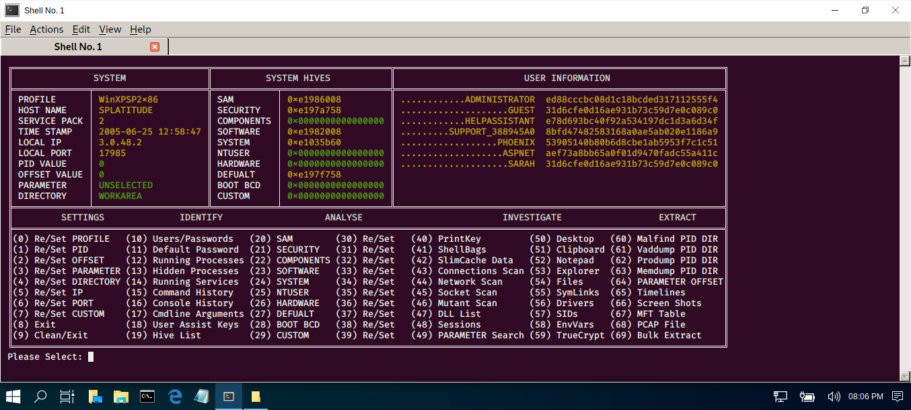

# RAM MASTER
## A PYTHON SCRIPT FILE TO FORENSICALLY INVESTIGATE AND ANALYSE MICROSOFT WINDOWS MEMORY DUMP FILES VIA VOLATILITY.

Usage: python RamMaster dumpfile.mem

| LANGUAGE  | FILENAME         | MD5 Hash                         |
|------     |------            | -------                          |
| python    | RamMaster.py     | 0c5bc1d3b34f2020ca4d016a2a6e602a |
| text file | profiles.txt     | 90a98544725dc945df30c20fabeb3e80 |
| bash file | patch.sh         | 7a4231731982e09d9a703f7357170755 |

- [x] Requires volatility (https://github.com/volatilityfoundation/volatility) to be installed.
- [x] Sample memory-dump files are available here:- 

      https://github.com/volatilityfoundation/volatility/wiki/Memory-Samples
      https://downloads.digitalcorpora.org/corpora/scenarios/2009-m57-patents/ram/

A python script file to forensically examine Microsoft Windows memory-dump files - It can pull usernames, password hashes, extract .pcap files, system executables, MFT tables, console keystroke, screenshots and much much more.

### CONSOLE DISPLAY

