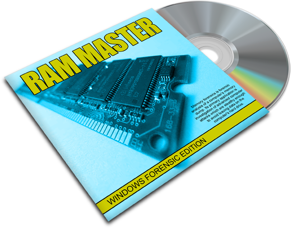

# MEMORY-MASTER
Python utility file to forensically investigate memory-dump files via volatility.

- [x] Requires volatility (https://github.com/volatilityfoundation/volatility) to be installed.
- [x] Sample memory dump files (https://github.com/volatilityfoundation/volatility/wiki/Memory-Samples) are available here.
- [ ] Still under construction, but what is there is working but not been fully tested.

| LANGUAGE  | FILENAME         | MD5 Hash                         |
|------     |------            | -------                          |
| python    | memory_master.py | ce401928eddc3f4bec7a1f668e4c3096 |
| text file | profiles.txt     | 90a98544725dc945df30c20fabeb3e80 |
| bash file | patch.sh         | 7a4231731982e09d9a703f7357170755 |

A python utility file that forensically examines Windows memory-dump files - It can pull password hashs, extract pcap files, MFT executables and much much more.

## CONSOLE DISPLAY

